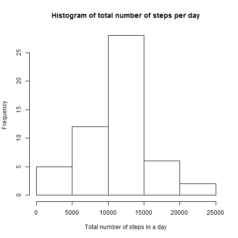
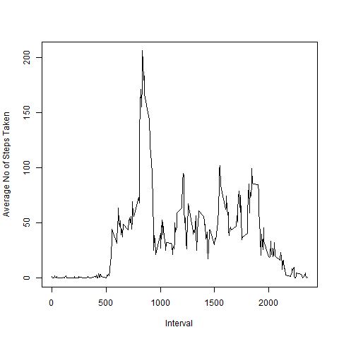
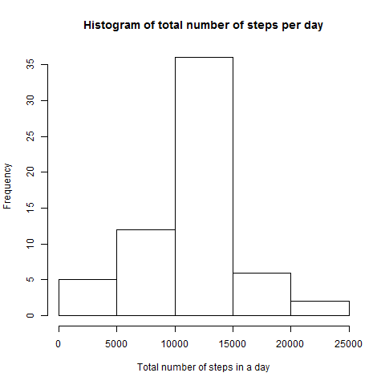
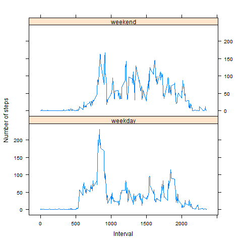

# Reproducible Research: Peer Assessment 1


## Loading and preprocessing the data

1. Load the data (i.e. read.csv()) 

```r
datFile<- unzip("activity.zip", )
allData <- read.csv("activity.csv", header = TRUE, sep = ",",na.strings = "NA")
```

2. Process/transform the data (if necessary) into a format suitable for your analysis

Load dplyr library for use in transforming:

```r
library(dplyr)
```

```
## Warning: package 'dplyr' was built under R version 3.1.3
```

```
## 
## Attaching package: 'dplyr'
## 
## The following object is masked from 'package:stats':
## 
##     filter
## 
## The following objects are masked from 'package:base':
## 
##     intersect, setdiff, setequal, union
```

Transform date character column to Date type:

```r
activityData <- allData[ with (allData, { !(is.na(steps)) } ), ]
activityData <- mutate(activityData,date=as.Date(date))
```

## What is mean total number of steps taken per day?

1. Calculate the total number of steps taken per day

Group data by date and get sum of steps per day, while removing NAs:


```r
sumPerDay<-summarise(group_by(activityData, date), dailySumSteps=sum(steps,na.rm=TRUE)  )
```
2. Make a histogram of the total number of steps taken each day


```r
if(!file.exists("figure")) {dir.create("figure")}

png(file = "figure/total_no_steps.png")

hist(sumPerDay$dailySumSteps, main="Histogram of total number of steps per day",xlab="Total number of steps in a day")

dev.off()
```

```
## png 
##   2
```
 

2. Calculate and report the mean and median of the total number of steps taken per day:

Median of the total number of steps taken per day:

```r
medianTotalSteps<- median(sumPerDay$dailySumSteps)
median(sumPerDay$dailySumSteps)
```

```
## [1] 10765
```

Mean of the total number of steps taken per day:

```r
meanTotalSteps<- mean(sumPerDay$dailySumSteps)

mean(sumPerDay$dailySumSteps)
```

```
## [1] 10766.19
```

The mean total number of steps taken per day is 1.0766189\times 10^{4} and the median total number of steps is 10765

## What is the average daily activity pattern?

1. Make a time series plot (i.e. type = "l") of the 5-minute interval (x-axis) and the average number of steps taken, averaged across all days (y-axis)

Group data by interval and get mean per interval, while removing NAs:


```r
meanPerFiveMin<-summarise(group_by(activityData, interval), meanFiveMinSteps=mean(steps,na.rm=TRUE)  )
```

Make the plot:

```r
png(file = "figure/time_series_nas_not_filled.png")
plot(meanPerFiveMin$interval, meanPerFiveMin$meanFiveMinSteps, type="l", xlab="Interval", ylab="Average No of Steps Taken")
dev.off()
```

```
## png 
##   2
```
 

2. Which 5-minute interval, on average across all the days in the dataset, contains the maximum number of steps?


```r
subset(meanPerFiveMin, meanFiveMinSteps==max(meanFiveMinSteps))[[1]][[1]]
```

The 5-minute interval which, on average across all the days in the dataset, contains the maximum number of steps is 835

## Imputing missing values

1. Calculate and report the total number of missing values in the dataset (i.e. the total number of rows with NAs)


```r
#reset activityData to have NAs as well, so that we can imput values for them

activityData <- mutate(allData,date=as.Date(date))
length(which(is.na(activityData$steps)))
```
The total number of rows with NAs are 2304

2. Devise a strategy for filling in all of the missing values in the dataset. The strategy does not need to be sophisticated. For example, you could use the mean/median for that day, or the mean for that 5-minute interval, etc. 

Create a copy of original data frame, that we will proceed and substitute NAs

```r
activityDataNoNAs<-activityData
```

Function to substitute NAs with mean of five minute interval

```r
replaceNAs <- function(rowNum) {
 
  activityDataNoNAs[[1]][[rowNum]]<<-subset(meanPerFiveMin,interval==activityDataNoNAs[[3]][[rowNum]])[[2]][[1]]
}
```

3. Create a new dataset that is equal to the original dataset but with the missing data filled in.

Call the substitution function for each index where we have an NA in the "step" column of the new dataset


```r
res<-lapply(as.list(which(is.na(activityData$steps))),  replaceNAs)
```
4. Make a histogram of the total number of steps taken each day and Calculate and report the mean and median total number of steps taken per day. Do these values differ from the estimates from the first part of the assignment? What is the impact of imputing missing data on the estimates of the total daily number of steps?

The values do not differ from the estimates from the first part of the assignment. The impact of imputing missing data on the estimates of the total daily number of steps is minimal. 

Group data by date, while removing NAs


```r
sumPerDayNoNAs<-summarise(group_by(activityDataNoNAs, date), dailySumSteps=sum(steps,na.rm=TRUE)  )
```

Histogram of the total number of steps taken each day


```r
png(file = "figure/total_no_steps_per_day.png")

hist(sumPerDayNoNAs$dailySumSteps, main="Histogram of total number of steps per day",xlab="Total number of steps in a day")

dev.off()
```
 

Mean and median of the total number of steps taken per day


```r
medianTotalStepsNoNAs<- median(sumPerDayNoNAs$dailySumSteps)

meanTotalStepsNoNAs<- mean(sumPerDayNoNAs$dailySumSteps)
```

The mean of the total number of steps taken per day is 1.0766189\times 10^{4} and the median of steps taken per day 1.0766189\times 10^{4}

Group data by date, while removing NAs


```r
meanPerFiveMinNoNAs<-summarise(group_by(activityData, interval), meanFiveMinSteps=mean(steps,na.rm=TRUE)  )
```

Time series plot (i.e. type = "l") of the 5-minute interval (x-axis) and the average number of steps taken, averaged across all days (y-axis)


```r
png(file = "figure/time_series_nas_filled_all_days.png")

plot(meanPerFiveMinNoNAs$interval, meanPerFiveMinNoNAs$meanFiveMinSteps, type="l", xlab="Interval", ylab="Average No of Steps Taken")
dev.off()
```
 


## Are there differences in activity patterns between weekdays and weekends?

The number of steps during weekends is generally higher than during weekdays. The number of steps during weekdays and weekends follow a similar pattern.

Create a new column to indicate whether date falls on a weekday or a weekend


```r
activityDataNoNAs$weekendOrWeekday <- ifelse(weekdays(activityDataNoNAs$date) %in% c("Saturday","Sunday"),"weekend","weekday")
```

1. Create a new factor variable in the dataset with two levels - "weekday" and "weekend" indicating whether a given date is a weekday or weekend day.


```r
activityDataNoNAs <- mutate(activityDataNoNAs,weekendOrWeekday=factor(weekendOrWeekday))
```
Get mean number of steps for each interval for weekdays and for weekends


```r
meanPerFiveMinNoNAs<-summarise(group_by(activityDataNoNAs, weekendOrWeekday,interval), meanFiveMinSteps=mean(steps,na.rm=TRUE)  )
```
2. Make a panel plot containing a time series plot (i.e. type = "l") of the 5-minute interval (x-axis) and the average number of steps taken, averaged across all weekday days or weekend days (y-axis) 


```r
library(lattice)
png(file = "figure/time_series_5min_nas_filled.png")

xyplot(meanFiveMinSteps ~ interval|weekendOrWeekday, data=meanPerFiveMinNoNAs, type="l", layout=c(1,2),xlab="Interval",ylab="Number of steps")

dev.off()
```
 

